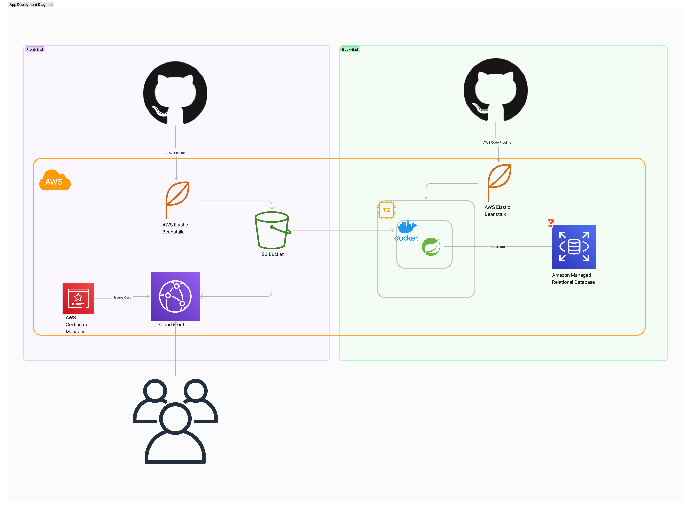
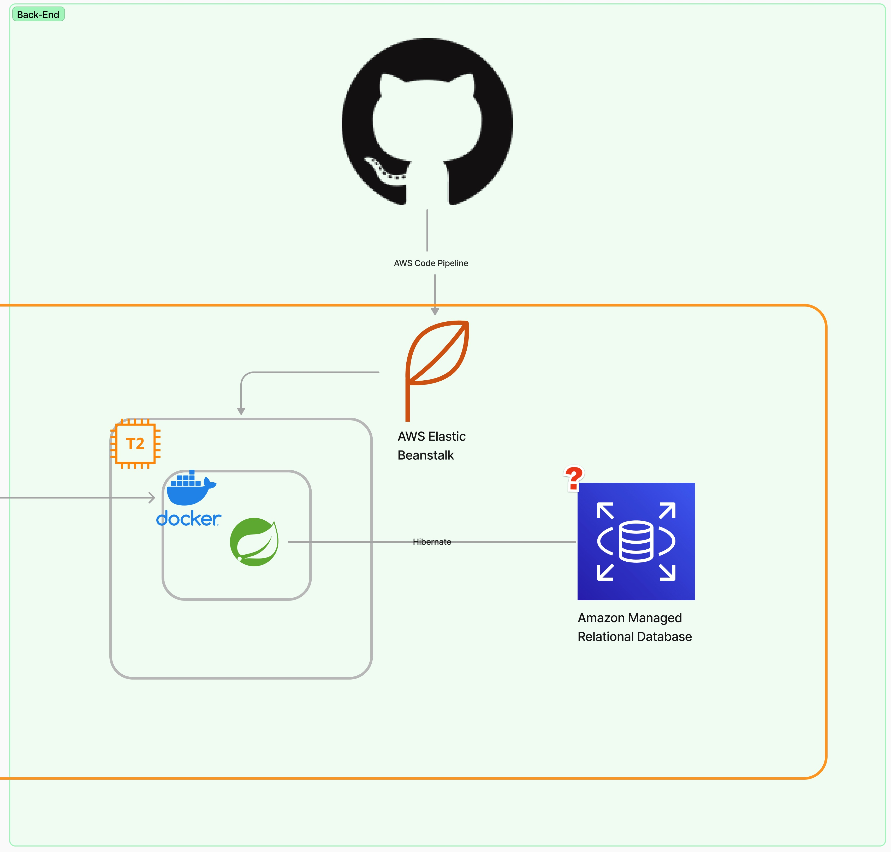
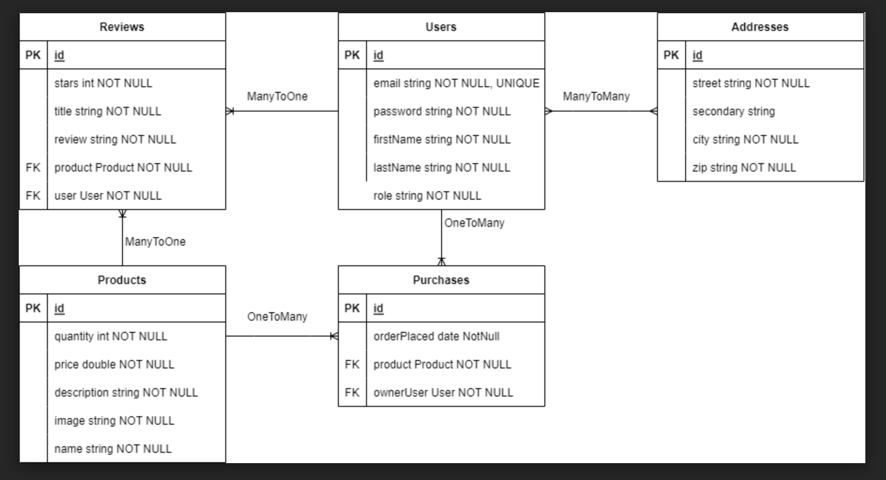

# Revazon


> Revazon is a sample e-commerce application that allows customers to buy Revature clothing and merchandise. This is a group project done as part of our cohort training at Revature.
---

### Table of Contents
You're sections headers will be used to reference location of destination.

- [Description](#description)
- [How To Use](#how-to-use)
- [References](#references)
- [License](#license)
- [Author Info](#author-info)

---

## Description

Creating ReadMe's for your Github repository can be tedious.  I hope this template can save you time and effort as well as provide you with some consistency across your projects.

#### Technologies

- Java
- Spring Boot
- Postgres
- AWS
- Docker
- Jacoco

#### Deployment Diagram





The backend is deployed in a cloud environment using AWS. A CI/CD pipeline is configured using Code Pipeline. EC2 instances host our application which is running in a Docker container. The application is written with Spring Boot and connects to AWS RDS service.

#### Database ER Diagram



---

## How To Use

#### Installation

```html
    git clone https://github.com/Revature-Sophia-ECommerce-1376/e-commerce-backend.git
```

#### Running the Application

```html
    sh build.sh
```

#### API Reference
https://app.swaggerhub.com/apis/ANDYHUGHES39_1/Revazon/1.0.0
```html
    
```


---

## References


---

## License

MIT License

Copyright (c) [2022] [Revature]

Permission is hereby granted, free of charge, to any person obtaining a copy
of this software and associated documentation files (the "Software"), to deal
in the Software without restriction, including without limitation the rights
to use, copy, modify, merge, publish, distribute, sublicense, and/or sell
copies of the Software, and to permit persons to whom the Software is
furnished to do so, subject to the following conditions:


---

## Contributors


[Back To The Top](#read-me-template)